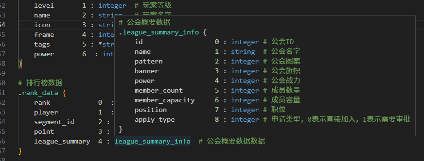

# 插件说明

该插件为 Skynet 开发提供了一些辅助功能，提供 Sproto 协议文件的支持，以及 Skynet 服务代码的调试能力。

# Sproto 支持

## Sproto 语法高亮


打开 `.sproto` 文件即可看到语法高亮效果。**需要注意`sproto`文件的扩展名必须是`.sproto`，否则无法识别。**

## Sproto 文件格式化


打开 `.sproto` 文件，右键选择 `Format Document` 即可格式化当前文件。
或者使用快捷键 `Shift + Alt + F` 进行格式化。
或者使用命令面板 `Ctrl + Shift + P`，输入 `SkynetHelper: Format Sproto` 进行格式化。

格式化之后会按如下顺序排列：
1. Header 注释
2. 类型定义
3. 协议定义

对于类型定义和协议定义会将冒号对齐，并且每个定义之间会空一行。

## Sproto 自定义类型提示功能



将鼠标放置到自定义的类型上会弹出提示框，显示该类型的定义。

## Sproto 自定义类型跳转功能


将鼠标放置到自定义的类型上，按住 `Ctrl` 键并点击即可跳转到该类型的定义。

# Skynet 服务调试

## 断点调试 skynet 服务中的 Lua 代码

配置`launch.json`，添加如下配置：

```json
{
    "name": "dev server",
    "type": "skynet-helper",
    "request": "launch",
    "workdir": "${workspaceFolder}/server/",
    "program": "./skynet/skynet",
    "config": "./config/config.dev",
    "service": "./skynet/service" // skynet内部服务，用于调试过滤，不调试skynet的内部服务
}
```

然后`F5`启动调试。这样就可以在自定义的`service`中设置断点进行调试了。

