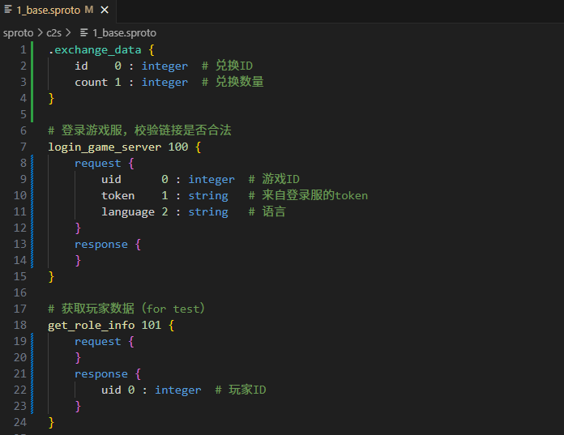
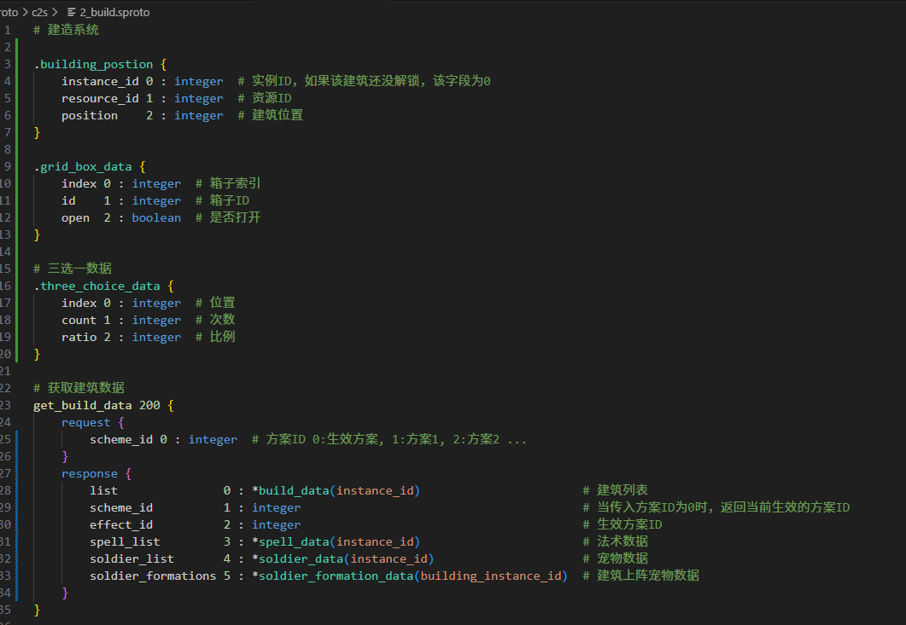
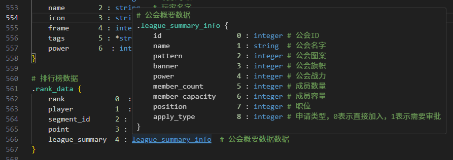
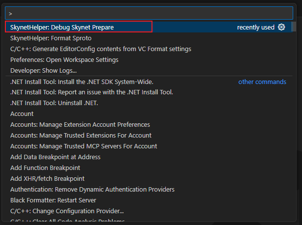
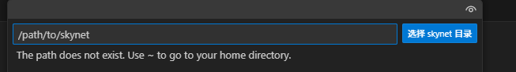
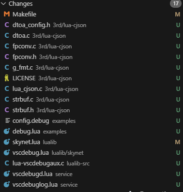
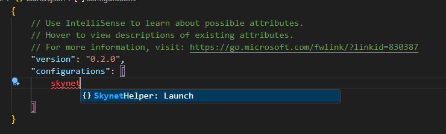
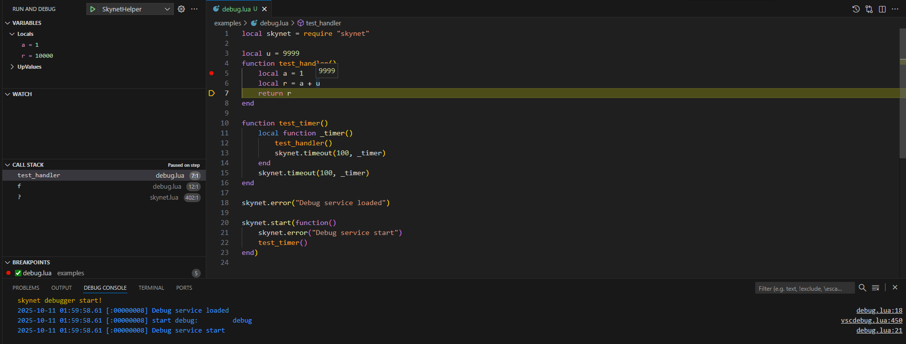
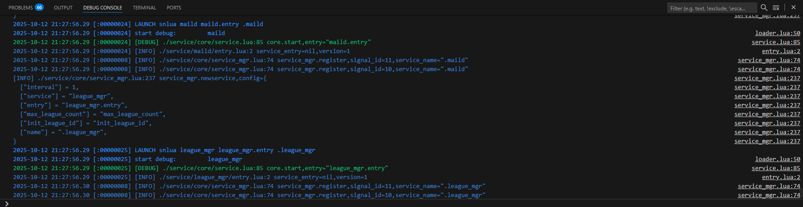
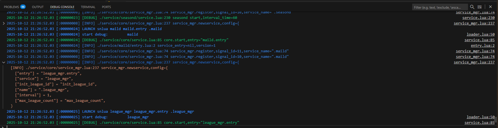

# 插件说明

该插件为 Skynet 开发提供了一些辅助功能，提供 Sproto 协议文件的支持，以及 Skynet 服务代码的调试能力。

# Sproto 支持

## Sproto 语法高亮



打开 `.sproto` 文件即可看到语法高亮效果。**需要注意`sproto`文件的扩展名必须是`.sproto`，否则无法识别。**

## Sproto 文件格式化



打开 `.sproto` 文件，右键选择 `Format Document` 即可格式化当前文件。
或者使用快捷键 `Shift + Alt + F` 进行格式化。
或者使用命令面板 `Ctrl + Shift + P`，输入 `SkynetHelper: Format Sproto` 进行格式化。

格式化之后会按如下顺序排列：
1. Header 注释
2. 类型定义
3. 协议定义

对于类型定义和协议定义会将冒号对齐，并且每个定义之间会空一行。

## Sproto 自定义类型提示功能


将鼠标放置到自定义的类型上会弹出提示框，显示该类型的定义。

## Sproto 自定义类型跳转功能



将鼠标放置到自定义的类型上，按住 `Ctrl` 键并点击即可跳转到该类型的定义。

# Skynet 服务调试

想要调试 skynet 服务中的lua代码, 可以按照下面两个步骤进行操作
1. 调试准备, 运行vscode指令
2. 添加调试配置
3. F5启动调试


## 1. 调试准备, 运行vscode指令

- 按下快捷键打开命令面板 `Ctrl + Shift + P`，输入 `SkynetHelper: Prepare Debug`，回车执行该命令。

!

- 执行之后需要选择你的skynet所在的路径, 然后确定
- 


- 可以通过git差异看到修改内容。



- 通过make linux重新编译skynet

## 2. 添加调试配置

配置`launch.json`，添加如下配置：

```json
{
    "name": "SkynetHelper",
    "type": "skynet-helper",
    "request": "launch",
    "workdir": "${workspaceFolder}",
    "program": "./skynet",
    "config": "./examples/config.debug",
    "service": "./service"
}
```

也可以在`launch.json`中选择 `Add Configuration...`，然后选择 `SkynetHelper: Launch`，会自动添加上述配置。


## 3. F5启动调试

然后`F5`启动调试。这样就可以在自定义的`service`中设置断点进行调试了。

在example中增加了一个简单的`debug`服务，可以用来测试调试功能。



## 调试功能包括
- 断点调试, 包括条件断点
- 单步调试
- 变量观察
- 调用栈查看

## 调试日志输出模式

支持两种日志输出模式, 可以在skynet的`config`文件中配置`logmodel`参数来选择日志模式
- 通用模式, 0: 打印所有日志
- 折叠模式, 1: 只打印日志的第一行,需要展开查看详细内容

下面是两种模式的输出差异
### 通用模式



### 折叠模式

